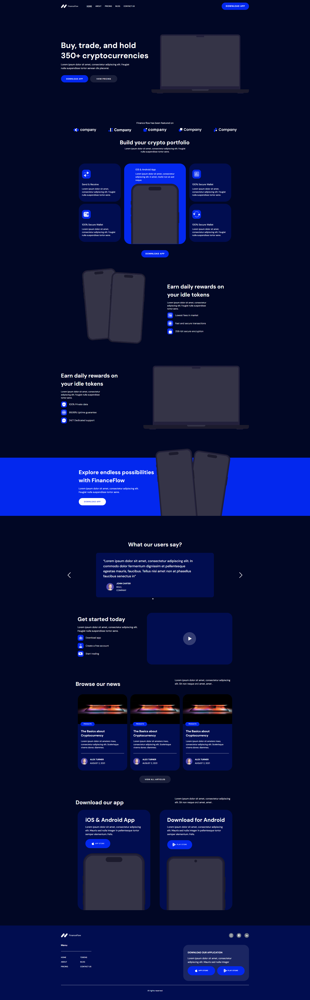

## Finance Flow

Bem-vindo ao Finance Flow, sua agência de criptomoedas de confiança! Este repositório contém o código-fonte do site da Finance Flow, onde você pode aprender mais sobre a empresa, explorar o aplicativo de criptomoedas e descobrir os planos de pagamento. 
link do site: <a href="https://finance-flow-virid.vercel.app/">FinanceFlow</a>

## Tecnologias Utilizadas

 
O site Finance Flow foi desenvolvido utilizando as tecnologias mais modernas e eficientes disponíveis atualmente. Aqui está uma visão geral das principais tecnologias utilizadas: 

- Next.js v14: Utilizei o Next.js, uma estrutura de aplicativo React de última geração, para desenvolver um site rápido, dinâmico e otimizado para SEO.
- Tailwind CSS: A estilização é feita com o Tailwind CSS, uma biblioteca CSS utilitária altamente personalizável que nos permite criar interfaces bonitas e responsivas de forma eficiente.
- Atomic Design: Adotei o Atomic Design como metodologia para organizar nossos componentes de forma escalável e reutilizável, promovendo consistência e facilitando o desenvolvimento.
- TypeScript: Optamos por usar TypeScript para adicionar tipagem estática ao nosso código, melhorando a robustez, a legibilidade e a manutenibilidade do mesmo.
- Radix UI: Incorporei componentes do Radix UI para criar uma interface de usuário acessível e consistente em todo o site.
- Swiper: Utilizei a biblioteca Swiper para implementar carrosséis e slides interativos em algumas partes do site, proporcionando uma experiência de usuário envolvente.

## Estrutura do Projeto

O projeto está organizado de acordo com os princípios do Atomic Design, o que significa que os componentes são divididos em átomos, moléculas, organismos, templates. Aqui está uma visão geral da estrutura do projeto:

- atoms/: Contém os componentes de menor granularidade, como botões, inputs e ícones.
- molecules/: Agrupa componentes que combinam dois ou mais átomos para formar unidades de interface mais complexas, como cartões e barras de navegação.
- organisms/: Inclui componentes compostos por moléculas e átomos, representando seções completas do site, como cabeçalhos, rodapés e seções de destaque.
- templates/: Define a estrutura das páginas, incluindo cabeçalho, rodapé e áreas de conteúdo, mas sem especificar o conteúdo real.

## Como Contribuir

Agradeço contribuições de qualquer tipo para melhorar nosso site e torná-lo ainda mais útil. Se você deseja contribuir, siga estas etapas:

1. Faça um fork deste repositório e clone-o para o seu ambiente de desenvolvimento local.
2. Crie uma nova branch para a sua contribuição: git checkout -b minha-contribuicao.
3. Faça suas alterações e adicione commits significativos descrevendo suas mudanças.
4. Empurre suas alterações para o seu fork: git push origin minha-contribuicao.
5. Abra um pull request para que possamos revisar suas alterações.

## Home do site

